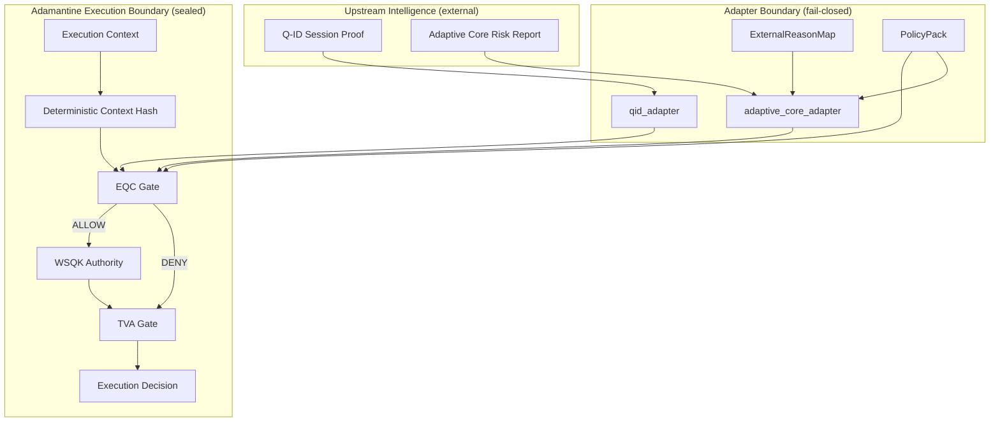

# 🔷 DigiByte Adamantine Wallet OS


---

## Status: Execution Boundary Sealed (Execution Boundary Only)

This repository contains a **clean, locked execution boundary** for the Adamantine Wallet OS.

The focus is **versioned contracts, invariants, and deterministic fail-closed execution**.
It is **not** a wallet runtime and does **not** manage keys, signing, broadcasting, or user interfaces.

---

## Implemented (Execution Boundary Sealed)

- **EQC v1** — deterministic decision foundation and context hashing
- **WSQK v1** — time-bound authority and scope enforcement (no key custody)
- **TVA Gate** — binding, expiry, and replay protection via injected nonce store
- **Nonce Store** — single-use nonce enforcement for replay protection
- **PolicyPack** — explicit thresholds and allowlists
- **ExternalReasonMap** — strict, versioned adapter reason mapping
- **Adapters** — validated integration boundaries (e.g. Q-ID, Adaptive Core)
- **End-to-end integration harness** (adapter + gate proofs) with high, stable coverage (~97%)

---

## Explicitly Not Implemented (By Design)

- Wallet runtime (keys, signing, broadcasting)
- Key generation, storage, or recovery
- Cloud syncing or remote custody
- Web or browser execution
- Mobile UI or client application logic
- Shield v3 / Adaptive Core v3 live runtime integration

Adamantine remains strictly an **execution boundary**.

---

## Purpose

**Adamantine Wallet OS** is not a traditional cryptocurrency wallet.

It is a **Wallet Operating System** whose sole responsibility is to ensure that
**only context-approved, deterministic, and user-authorised actions are allowed
to execute**, even under hostile conditions such as compromised devices,
malicious inputs, or replay attempts.

Adamantine exists to make *unsafe wallet behaviour impossible by design*.

---

## What Adamantine IS

Adamantine Wallet OS is:

- a **deterministic execution boundary** for DigiByte wallets
- a **consumer of external intelligence**, not a generator of it
- **key-custody neutral** (keys are always external)
- **mobile-first** (iOS and Android only)
- **consensus-neutral**
- **open-source and auditable** (MIT licensed)

Adamantine answers a single question:

> *“Is this execution allowed, right now, under these conditions?”*

---

## What Adamantine is NOT

Adamantine is **not**:

- a wallet UI or runtime
- a key manager or signer
- a DigiByte node or consensus component
- a web wallet
- an AI or learning system
- a monolithic “do-everything” wallet

All learning, intelligence, and risk assessment occur **outside** Adamantine.

---

## Architectural Position

Adamantine sits at the **final execution boundary** of the DigiByte security stack.

Execution pipeline:

```
EQC → WSQK → TVA → Execution Decision
```

Upstream systems may observe, analyse, classify, recommend, or warn.
**Only Adamantine produces the final allow/deny execution decision.**

---

## Architecture Diagram



---

## Core Principle

> **Decision, authority, and execution are never combined.**

Adamantine enforces execution **only after**:
- a valid decision exists
- authority is explicitly declared and time-bound
- context integrity is verified
- replay protection passes

There are no bypass paths.

---

## Security Philosophy

Adamantine is built on strict invariants:

- deny-by-default
- fail-closed on ambiguity
- no hidden authority
- deterministic behaviour only
- explicit versioned contracts
- explainability over automation

These rules are defined in `INVARIANTS.md` and apply to all future development.

---

## Roadmap Position

This repository represents a **sealed execution boundary baseline**.

Next work introduces additional wiring and integration surfaces **only after** contracts remain stable:
- strict request/response envelopes
- mobile integration boundaries (iOS / Android)
- controlled orchestration around the execution boundary

---

## License

MIT License — **DarekDGB**
