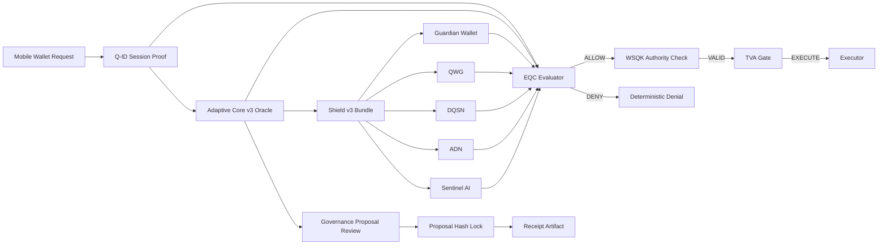

  

# 🔷 DigiByte Adamantine Wallet OS

------------------------------------------------------------------------

## What is AdamantineOS?

Adamantine Wallet OS is a **deterministic security decision engine for
digital wallets and autonomous systems**.

It verifies execution requests using:

• **Q-ID identity proofs**\
• **Adaptive Core oracle intelligence**\
• **Shield v3 security layers**\
• **Deterministic governance review**\
• **WSQK v2 quantum-aware authority proofs**

Only after all layers pass verification can execution occur.

AdamantineOS is **not a wallet UI**.

It is the **trust enforcement engine** behind secure wallet systems.

------------------------------------------------------------------------

## Why AdamantineOS Exists

Modern wallet systems and autonomous applications rely on multiple
external signals:

• identity proofs\
• oracle intelligence\
• AI security analysis\
• governance proposals\
• runtime policies\
• quantum-aware authority proofs

Most systems **trust these signals blindly**.

AdamantineOS exists to enforce **deterministic trust verification**.

Instead of trusting external inputs, AdamantineOS:

• verifies identity using **Q-ID cryptographic proofs**\
• validates oracle intelligence from **Adaptive Core**\
• evaluates security evidence from **Shield v3 layers**\
• enforces deterministic **fail-closed decision rules**\
• verifies governance proposals through **artifact hashing and receipt
validation**\
• enforces **WSQK v2 quantum-aware authority** through TVA and Q-ID posture binding

Execution is allowed **only when every layer passes verification**.

If any layer fails → execution is deterministically denied.

AdamantineOS therefore acts as a **trust firewall for wallet
execution**.

------------------------------------------------------------------------

## v2.2.0 --- WSQK v2 Quantum-Aware Upgrade

**Status:** Locked\
**Type:** Quantum-aware authority upgrade\
**Compatibility:** Additive --- legacy/v1 paths remain compatible unless WSQK v2 is explicitly required

This release upgrades WSQK inside AdamantineOS into a quantum-aware authority layer.

### What's locked:

1.  WSQK v2 Authority Contract
    -   `WSQKAuthorityV2` and `WSQKIssueRequestV2`
    -   sorted canonical unique `required_evidence_families`
    -   deterministic `proof_bindings_hash`
2.  Truth Vector Authority (TVA) Enforcement
    -   WSQK v2 posture requirements are enforced fail-closed
    -   tampered bindings are denied before nonce use
    -   WSQK v1 cannot satisfy explicit WSQK v2 requirements
3.  Q-ID Hybrid Posture Binding
    -   `hybrid_required` requires classical AND PQC posture
    -   `pqc_required` requires PQC evidence
    -   posture mismatches deny deterministically
4.  Runtime Boundary Propagation
    -   orchestrator/runtime paths propagate WSQK v2 requirements
    -   no silent v1 fallback when v2 is required
5.  Tamperproof Regression Locks
    -   hash tampering, context tampering, family drift, downgrade attempts,
        and Q-ID posture tamper are covered by tests
    -   WSQK v2 proof pack maps contracts → invariants → implementation → tests → CI proof

Key invariant:

`required_evidence_families` MUST be stored and compared as a sorted canonical set.

------------------------------------------------------------------------

## v2.1.0 --- AC v3 Governance Compatibility Lock

**Status:** Locked\
**Type:** Compatibility lock (Adaptive Core v3 governance path sealed)\
**Compatibility:** Additive --- no production behavior changes

This release locks AdamantineOS compatibility with Adaptive Core v3
`upgrade_proposal_v3` artifacts and seals the first cross-repository
governance evaluation path.

### What's locked:

1.  Adaptive Core v3 Governance Compatibility
    -   Proven compatibility with Adaptive Core v3 `upgrade_proposal_v3`
        artifacts
    -   Stable proposal ingestion and validation path
    -   Deterministic evaluation of governance proposals
2.  Cross-Repository Hash Invariant
    -   Deterministic `proposal_hash` invariant enforced across
        repositories
    -   Hash drift fails CI
    -   Canonical compatibility vector frozen
3.  Governance Receipt Path Frozen
    -   Compatibility vectors frozen in CI (`approve` + receipt path)
    -   First upgrade proposal review path sealed end-to-end
    -   Stable review receipt artifact boundary
4.  Boundary Guarantees Reinforced
    -   No production behavior changes
    -   Governance compatibility locked without expanding runtime trust
    -   Strengthened boundary between proposal artifacts and execution
        behavior

Rule: Any semantic change to Adaptive Core v3 governance artifact
handling requires a new versioned compatibility lock.

------------------------------------------------------------------------

# 🧱 Architecture Overview

Adamantine enforces layered validation before any execution is
permitted, seals deterministic compatibility with Adaptive Core v3
governance proposal artifacts, and now enforces WSQK v2 quantum-aware
authority through Q-ID posture binding and TVA.

------------------------------------------------------------------------

# 📚 Governance Documentation

AdamantineOS v2.1.0 introduces the first deterministic governance
compatibility path with **Adaptive Core v3**.

The governance architecture and artifact contracts are documented here:

-   [Adaptive Core → Adamantine Governance
    Flow](docs/ADAPTIVE_CORE_GOVERNANCE_FLOW.md)\
-   [Governance Artifact Examples (Real
    Artifacts)](docs/GOVERNANCE_ARTIFACT_EXAMPLES.md)\
-   [Governance Review
    Contract](docs/CONTRACTS/upgrade_governance_review_v1.md)\
-   [Governance Compatibility Proof
    Pack](docs/PROOF_v2.1.0_GOVERNANCE_COMPATIBILITY.md)

Governance pipeline:

Adaptive Core\
→ generates `upgrade_proposal_v3`

AdamantineOS\
→ validates proposal artifacts\
→ verifies deterministic `proposal_hash` invariants\
→ evaluates governance policy\
→ emits `ac_review_receipt_v1`\
→ produces deterministic allow / deny decision.

------------------------------------------------------------------------

# 🛡️ WSQK v2 Quantum-Aware Authority

WSQK v2 binds wallet authority to explicit quantum-security posture.

Documented proof path:

-   [WSQK Authority v2
    Contract](docs/CONTRACTS/wsqk_authority_v2.md)\
-   [WSQK v2 Quantum-Aware Proof
    Pack](docs/PROOF_PACKS/wsqk_v2_quantum_aware_proof_pack.md)

WSQK v2 is enforced through:

WSQK v2 authority proof\
→ Q-ID classical/PQC posture binding\
→ Truth Vector Authority (TVA) enforcement\
→ Orchestrator/runtime propagation\
→ deterministic allow / deny decision.

------------------------------------------------------------------------

# 🔐 Protection Modes

Every execution response includes a deterministic security posture.

### 🟢 `legacy`

-   Q-ID missing or invalid
-   Protected execution not requested
-   Baseline evaluation only

### 🟡 `minimal`

-   Q-ID valid
-   Shield or Oracle incomplete
-   Reduced security guarantees

### 🔵 `full`

-   Q-ID valid
-   Shield v3 valid
-   Adaptive Core v3 Oracle valid
-   All layers enforced

Protection mode semantics are regression locked in CI.

------------------------------------------------------------------------

# 🔐 Q-ID Cryptographic Enforcement (Runtime-Verified)

AdamantineOS v2 integrates DigiByte Q-ID with explicit runtime
enforcement.

-   Runtime may inject a `qid_verifier` cryptographic hook
-   If provided, it is invoked **before Q-ID session parsing**
-   Any verifier failure deterministically denies execution
-   No silent downgrade path
-   No implicit trust of unsigned evidence

Coverage remains 100%.

------------------------------------------------------------------------

# 🔒 Core Invariants

Adamantine enforces:

-   Fail‑closed evaluation
-   Canonical Shield ordering
-   No duplicate layers
-   Strict version discipline
-   No silent downgrade under policy
-   Shield evidence can only strengthen deny
-   Deterministic outputs for identical inputs
-   Replay attempts deterministically denied when enforced
-   Manifest drift fails CI
-   Hash drift fails CI
-   Proposal hash drift fails CI across Adaptive Core v3 compatibility
    vectors
-   Governance receipt path remains deterministic once sealed
-   WSQK v2 evidence families remain sorted, canonical, and hash-stable
-   WSQK v2 cannot silently downgrade to v1 when v2 is required

If any invariant weakens, tests fail.

------------------------------------------------------------------------

# 📦 Scope

### Included

-   Execution envelope contracts (v1 + v2)
-   Orchestrator v2
-   EQC evaluator
-   WSQK v2 quantum-aware authority proof
-   Shield v3 adapter
-   Adaptive Core v3 adapter
-   Adaptive Core v3 governance compatibility path
-   Proposal review receipt boundary
-   Q-ID adapter
-   Truth Vector Authority (TVA) boundary enforcement
-   Deterministic proof packs (v1.2.0 → v2.2.0)
-   Compatibility vectors for AC v3 proposal review
-   WSQK v2 quantum-aware proof pack

### Excluded

-   Wallet UI
-   Key custody
-   Transaction building
-   Network broadcasting

Adamantine is a **decision engine**, not a wallet.

------------------------------------------------------------------------

# 🧪 Determinism & Testing

-   100% coverage enforced
-   Fixture hashes locked
-   Canonical JSON duplicate-key rejection
-   Strict manifest enforcement
-   Deterministic replay validation (50-run runtime tests)
-   Adaptive Core v3 compatibility vectors frozen in CI
-   CI rejects silent behavioral drift
-   WSQK v2 tamperproof regression locks remain enforced

Security changes require test changes.

------------------------------------------------------------------------

# 🧭 Version History

-   v2.2.0 --- WSQK v2 Quantum-Aware Upgrade
-   v2.1.0 --- AC v3 Governance Compatibility Lock
-   v2.0.1 --- 100% Coverage Gate + Integrity Lock
-   v2.0.0 --- Runtime Host v2 + Execution Boundary Seal
-   v1.5.0 --- Mobile Contract v2 + Conformance Freeze
-   v1.4.0 --- Q-ID Replay Proof Gate
-   v1.3.0 --- Shield Interfaces Frozen
-   v1.2.0 --- Integration Harness Sealed
-   v1.0.0 --- Foundation Sealed

------------------------------------------------------------------------

**Adamantine Wallet OS**\
Deterministic. Fail‑Closed. Quantum‑Aware. Governance‑Compatible.

------------------------------------------------------------------------

## Project Author

Created and maintained by **DarekDGB**

AdamantineOS is part of the broader **DigiByte Quantum Shield
architecture**.

------------------------------------------------------------------------

## License

MIT License --- **DarekDGB**
