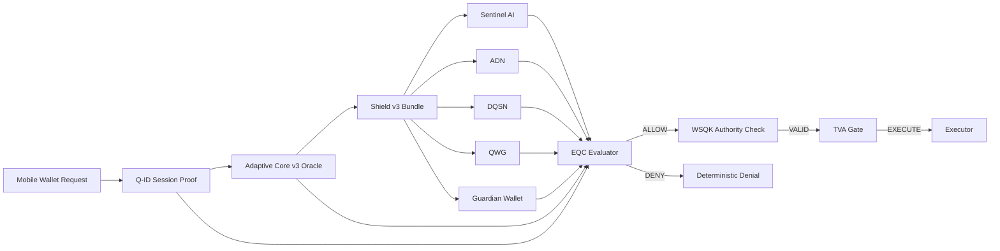

```{=html}
<p align="center">
```
``{=html}
```{=html}
</p>
```
# 🔷 DigiByte Adamantine Wallet OS


------------------------------------------------------------------------

## 🚀 Runtime Boundary Seal (v2.0.0)

Adamantine Wallet OS is a deterministic security execution boundary for
wallets.\
Originally developed for DigiByte wallets. Designed to be
chain-agnostic.

It does **not** hold keys.\
It does **not** sign transactions.\
It decides --- deterministically and fail‑closed --- whether an action
is allowed.

v2.0.0 permanently locks:

-   Runtime Host v2 as authoritative execution entrypoint
-   `execution_response_v2` contract freeze
-   Deterministic nonce consumption semantics
-   Stable `decision`, `reason_id`, and `context_hash`
-   Locked `artifacts` shape
-   Fail‑closed adapter enforcement
-   Canonical JSON enforcement
-   Proof Pack v2_0\_0_runtime (request + response fixtures)
-   SHA‑256 manifest freeze with strict CI validation
-   50‑run determinism replay verification

Any structural change to `execution_response_v2` requires a new **major
version**.

------------------------------------------------------------------------

# 🧱 Architecture Overview



Adamantine enforces layered validation before any execution is
permitted.

------------------------------------------------------------------------

# 🔐 Protection Modes

Every execution response includes a deterministic security posture.

### 🟢 `legacy`

-   Q-ID missing or invalid\
-   Protected execution not requested\
-   Baseline evaluation only

### 🟡 `minimal`

-   Q-ID valid\
-   Shield or Oracle incomplete\
-   Reduced security guarantees

### 🔵 `full`

-   Q-ID valid\
-   Shield v3 valid\
-   Adaptive Core v3 Oracle valid\
-   All layers enforced

Protection mode semantics are regression locked in CI.

------------------------------------------------------------------------

# 🔒 Core Invariants

Adamantine enforces:

-   Fail‑closed evaluation
-   Canonical Shield ordering
-   No duplicate layers
-   Strict version discipline
-   No silent downgrade under policy
-   Shield evidence can only strengthen deny
-   Deterministic outputs for identical inputs
-   Replay attempts deterministically denied when enforced
-   Manifest drift fails CI
-   Hash drift fails CI

If any invariant weakens, tests fail.

------------------------------------------------------------------------

# 📦 Scope

### Included

-   Execution envelope contracts (v1 + v2)
-   Orchestrator v2
-   EQC evaluator
-   WSQK authority proof
-   Shield v3 adapter
-   Adaptive Core v3 adapter
-   Q-ID adapter
-   TVA boundary enforcement
-   Deterministic proof packs (v1.2.0 → v2.0.0)

### Excluded

-   Wallet UI
-   Key custody
-   Transaction building
-   Network broadcasting

Adamantine is a **decision engine**, not a wallet.

------------------------------------------------------------------------

# 🧪 Determinism & Testing

-   ≥ 90% coverage enforced (currently \~91%)
-   Fixture hashes locked
-   Canonical JSON duplicate-key rejection
-   Strict manifest enforcement
-   Deterministic replay validation (50-run runtime tests)
-   CI rejects silent behavioral drift

Security changes require test changes.

------------------------------------------------------------------------

# 🧭 Version History

-   v2.0.0 --- Runtime Host v2 + Execution Boundary Seal
-   v1.5.0 --- Mobile Contract v2 + Conformance Freeze
-   v1.4.0 --- Q-ID Replay Proof Gate
-   v1.3.0 --- Shield Interfaces Frozen
-   v1.2.0 --- Integration Harness Sealed
-   v1.0.0 --- Foundation Sealed

------------------------------------------------------------------------

**Adamantine Wallet OS**\
Deterministic. Fail‑Closed. Production‑Sealed.

------------------------------------------------------------------------

## License

MIT License --- **DarekDGB**
