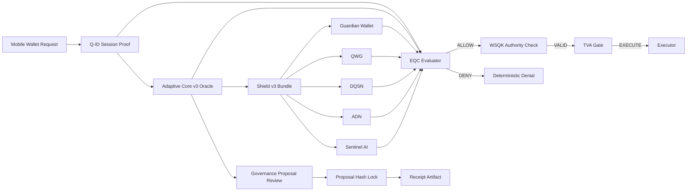

  

# 🔷 DigiByte Adamantine Wallet OS

------------------------------------------------------------------------

## v2.1.0 — AC v3 Governance Compatibility Lock

**Status:** Locked  
**Type:** Compatibility lock (Adaptive Core v3 governance path sealed)  
**Compatibility:** Additive — no production behavior changes

This release locks AdamantineOS compatibility with Adaptive Core v3 `upgrade_proposal_v3` artifacts and seals the first cross-repository governance evaluation path.

### What's locked:

1. Adaptive Core v3 Governance Compatibility
   - Proven compatibility with Adaptive Core v3 `upgrade_proposal_v3` artifacts
   - Stable proposal ingestion and validation path
   - Deterministic evaluation of governance proposals

2. Cross-Repository Hash Invariant
   - Deterministic `proposal_hash` invariant enforced across repositories
   - Hash drift fails CI
   - Canonical compatibility vector frozen

3. Governance Receipt Path Frozen
   - Compatibility vectors frozen in CI (`approve` + receipt path)
   - First upgrade proposal review path sealed end-to-end
   - Stable review receipt artifact boundary

4. Boundary Guarantees Reinforced
   - No production behavior changes
   - Governance compatibility locked without expanding runtime trust
   - Strengthened boundary between proposal artifacts and execution behavior

Rule: Any semantic change to Adaptive Core v3 governance artifact handling requires a new versioned compatibility lock.

------------------------------------------------------------------------

# 🧱 Architecture Overview

Adamantine enforces layered validation before any execution is permitted, and now also seals deterministic compatibility with Adaptive Core v3 governance proposal artifacts.

------------------------------------------------------------------------

# 🔐 Protection Modes

Every execution response includes a deterministic security posture.

### 🟢 `legacy`

-   Q-ID missing or invalid
-   Protected execution not requested
-   Baseline evaluation only

### 🟡 `minimal`

-   Q-ID valid
-   Shield or Oracle incomplete
-   Reduced security guarantees

### 🔵 `full`

-   Q-ID valid
-   Shield v3 valid
-   Adaptive Core v3 Oracle valid
-   All layers enforced

Protection mode semantics are regression locked in CI.

------------------------------------------------------------------------

# 🔐 Q-ID Cryptographic Enforcement (Runtime-Verified)

AdamantineOS v2 integrates DigiByte Q-ID with explicit runtime enforcement.

-   Runtime may inject a `qid_verifier` cryptographic hook
-   If provided, it is invoked **before Q-ID session parsing**
-   Any verifier failure deterministically denies execution
-   No silent downgrade path
-   No implicit trust of unsigned evidence

When protected execution and replay enforcement are required by policy:

-   `wallet_id` must match
-   `subject` must match
-   `proof_hash` must match
-   `device_binding` must match
-   `session_nonce` must match
-   Freshness is enforced

Runtime wiring is regression-locked in CI:

-   Verifier invocation is tested
-   Invocation order is tested
-   Failure path is tested
-   RuntimeHost → Orchestrator threading is tested

Coverage remains 100%.

If a runtime supplies cryptographic verification (e.g. Q-ID signature validation), forged or unsigned session payloads cannot reach EQC evaluation.

------------------------------------------------------------------------

# 🔒 Core Invariants

Adamantine enforces:

-   Fail‑closed evaluation
-   Canonical Shield ordering
-   No duplicate layers
-   Strict version discipline
-   No silent downgrade under policy
-   Shield evidence can only strengthen deny
-   Deterministic outputs for identical inputs
-   Replay attempts deterministically denied when enforced
-   Manifest drift fails CI
-   Hash drift fails CI
-   Proposal hash drift fails CI across Adaptive Core v3 compatibility vectors
-   Governance receipt path remains deterministic once sealed

If any invariant weakens, tests fail.

------------------------------------------------------------------------

# 📦 Scope

### Included

-   Execution envelope contracts (v1 + v2)
-   Orchestrator v2
-   EQC evaluator
-   WSQK authority proof
-   Shield v3 adapter
-   Adaptive Core v3 adapter
-   Adaptive Core v3 governance compatibility path
-   Proposal review receipt boundary
-   Q-ID adapter
-   TVA boundary enforcement
-   Deterministic proof packs (v1.2.0 → v2.0.0)
-   Compatibility vectors for AC v3 proposal review

### Excluded

-   Wallet UI
-   Key custody
-   Transaction building
-   Network broadcasting

Adamantine is a **decision engine**, not a wallet.

------------------------------------------------------------------------

# 🧪 Determinism & Testing

-   100% coverage enforced
-   Fixture hashes locked
-   Canonical JSON duplicate-key rejection
-   Strict manifest enforcement
-   Deterministic replay validation (50-run runtime tests)
-   Adaptive Core v3 compatibility vectors frozen in CI
-   CI rejects silent behavioral drift

Security changes require test changes.

------------------------------------------------------------------------

# 🧭 Version History
-   v2.1.0 --- AC v3 Governance Compatibility Lock
-   v2.0.1 --- 100% Coverage Gate + Integrity Lock
-   v2.0.0 --- Runtime Host v2 + Execution Boundary Seal
-   v1.5.0 --- Mobile Contract v2 + Conformance Freeze
-   v1.4.0 --- Q-ID Replay Proof Gate
-   v1.3.0 --- Shield Interfaces Frozen
-   v1.2.0 --- Integration Harness Sealed
-   v1.0.0 --- Foundation Sealed

------------------------------------------------------------------------

**Adamantine Wallet OS**  
Deterministic. Fail‑Closed. Governance‑Compatible.

------------------------------------------------------------------------

## License

MIT License --- **DarekDGB**
