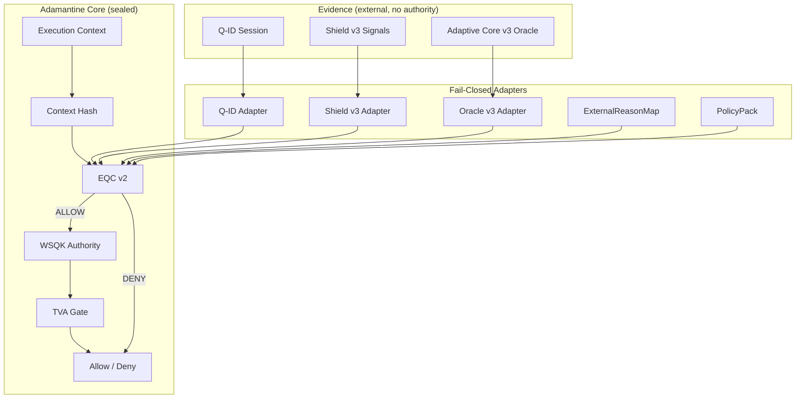

# 🔷 DigiByte Adamantine Wallet OS

---

## Status: Foundation Sealed (Contracts + Deterministic Reasoning)

This repository contains the **sealed foundation** of the **Adamantine Wallet OS**.

Adamantine is a **deterministic security decision engine** for DigiByte wallets.
It defines **what is allowed to execute**, **under which conditions**, and **why** —
without managing keys, signing transactions, or running a wallet UI.

All critical boundaries are **versioned, tested, and fail-closed**.

---

## What Is Included (Foundation Complete)

### Decision & Authority Core
- **EQC v1 + v2**
  - v1: deterministic baseline decision logic
  - v2: **multi-evidence reasoning** (Q-ID + Shield + Adaptive Core)
- **WSQK v1**
  - scoped, time-bound authority (no key custody)
- **TVA Gate**
  - authority binding, expiry enforcement, replay protection
- **Nonce Store**
  - injected, single-use replay prevention

### Evidence & Adapters (Fail-Closed)
- **Q-ID Adapter**
  - session validity, time window enforcement
- **Shield v3**
  - evidence-only defensive signals (Sentinel AI, ADN, DQSN, QWG, Guardian Wallet)
  - strict adapter validation (no authority, no execution)
- **Adaptive Core v3 Oracle**
  - deterministic risk evidence
  - context-bound, time-bound, evidence-only
- **ExternalReasonMap**
  - strict mapping of external signals → internal `ReasonId`
- **PolicyPack**
  - explicit thresholds, allowlists, and deny-by-default rules

### Mobile Consumption (No Runtime)
- **Mobile execution boundary (v1)**
- **Mobile decision result contract**
- **ReasonId → UX-safe reason mapping**
- **Deterministic mobile result builder**
- Mobile apps consume **decisions only**, never execute logic

---

## Explicitly NOT Included (By Design)

Adamantine **does not**:
- manage or store private keys
- sign or broadcast transactions
- build wallet UI
- persist user data
- sync to cloud services
- perform learning or AI inference
- act as a DigiByte node or consensus component

Adamantine is **not a wallet**.
It is the **security operating system** that wallets embed.

---

## Architecture Diagram

---

## Core Principles

- deny-by-default
- fail-closed on ambiguity
- evidence ≠ authority ≠ execution
- deterministic behaviour only
- explicit versioned contracts
- no hidden power
- explainability over automation

These invariants are enforced in code and tests.

---

## Coverage & Testing Philosophy

- High coverage focused on **security-critical paths**
- Contract validation tested separately from adapters
- Runtime stubs intentionally excluded until implemented
- Negative-first testing
- Determinism and replay safety enforced

Current coverage: **>90%**, with all critical logic covered.

---

## Roadmap Position

This repository represents a **sealed foundation**.

Future work (additive only):
- mobile SDK integration
- wallet runtime implementations (outside this repo)
- UI/UX layers
- additional shield/oracle implementations

All future work must respect the frozen contracts and invariants defined here.

---

## License

MIT License — **DarekDGB**
