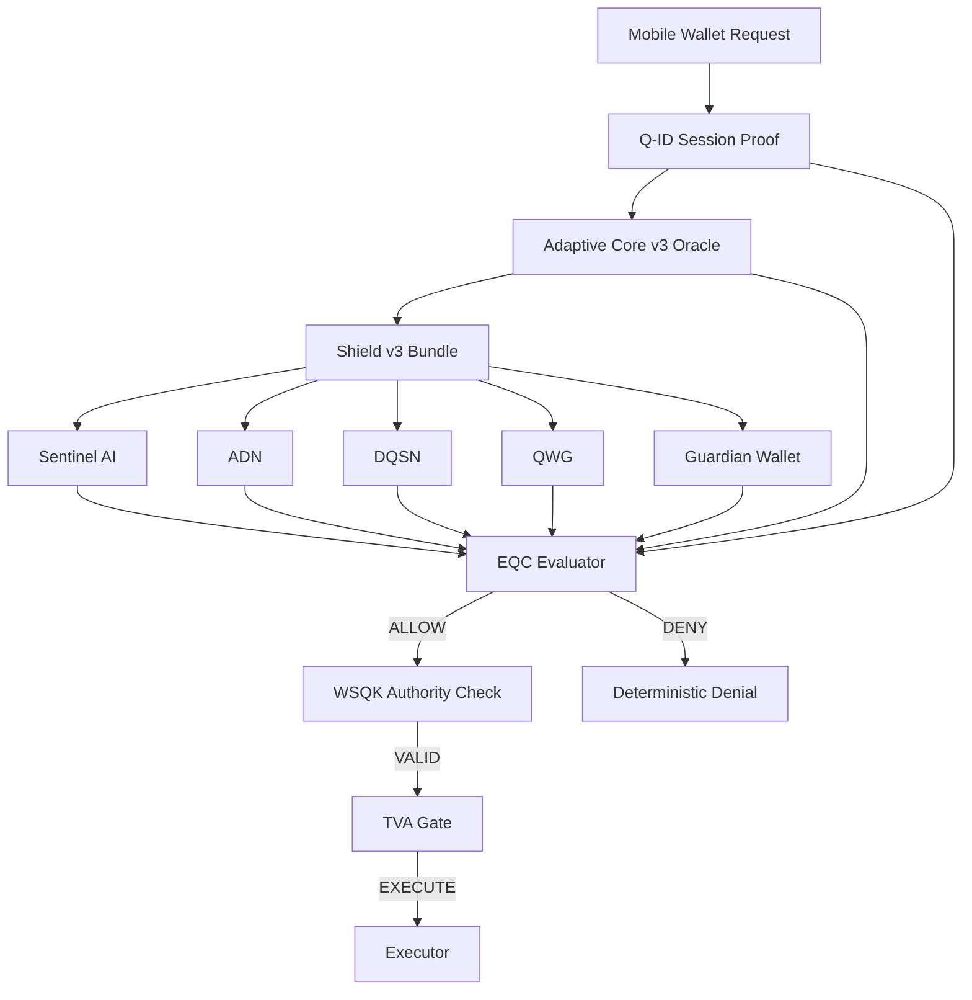

# 🔷 DigiByte Adamantine Wallet OS

------------------------------------------------------------------------

## 🛡 Shield Interfaces Frozen + Posture Locked (v1.3.0)

Adamantine Wallet OS is a **deterministic security execution boundary**
for DigiByte wallets.

It does **not** hold keys.\
It does **not** sign transactions.\
It decides --- deterministically and fail‑closed --- whether an action
is allowed.

v1.3.0 permanently locks:

-   Shield v3 strict schema + canonical ordering\
-   Deterministic size caps + toxic input denial\
-   No‑silent‑downgrade enforcement\
-   Protection mode posture output (`legacy` \| `minimal` \| `full`)\
-   Shield "never weaken deny" invariant\
-   Protection mode matrix regression lock\
-   Proof pack fixtures + manifest freeze

From this point forward, contracts are sealed. Only status evolves.

------------------------------------------------------------------------

# 🧱 Architecture Overview

Adamantine enforces layered validation before any execution is
permitted.

------------------------------------------------------------------------

# 🔐 Protection Modes

Every execution response includes a deterministic security posture:

  Mode          Meaning
  ------------- ------------------------------------------------------
  **legacy**    Q-ID missing/invalid OR protected call not requested
  **minimal**   Q-ID valid but Shield/Oracle incomplete
  **full**      Q-ID + Shield v3 + Oracle v3 all valid

Protection mode is regression-locked.\
Any change in semantics breaks CI.

------------------------------------------------------------------------

# 🔒 Core Invariants

Adamantine enforces:

-   Fail-closed evaluation\
-   Canonical Shield ordering\
-   No duplicate layers\
-   Strict version discipline\
-   No silent downgrade under policy\
-   Shield evidence can only strengthen deny\
-   Deterministic outputs for identical inputs

If any invariant weakens, tests fail.

------------------------------------------------------------------------

# 📦 Scope

Included:

-   Execution envelope contracts\
-   Orchestrator v2\
-   EQC evaluator\
-   Shield v3 adapter\
-   Adaptive Core v3 adapter\
-   Q-ID adapter\
-   TVA boundary enforcement\
-   Deterministic proof packs

Excluded:

-   Wallet UI\
-   Key custody\
-   Transaction building\
-   Network broadcasting

Adamantine is a **decision engine**, not a wallet.

------------------------------------------------------------------------

# 🧪 Determinism & Testing

-   90% coverage enforced\
-   Fixture hashes locked\
-   Proof packs frozen\
-   Regression locks for posture + shield invariants

Security changes require test changes.\
Silent drift is impossible.

------------------------------------------------------------------------

# 🧭 Roadmap

v1.3.0 completes Shield v3 freeze and posture enforcement.

Next phase:

-   Integration harness expansion\
-   Cross-repo deterministic contracts\
-   Orchestrator compatibility envelope sealing

------------------------------------------------------------------------

**Adamantine Wallet OS**\
Deterministic. Fail‑Closed. Future‑Ready.

------------------------------------------------------------------------

## License

MIT License --- **DarekDGB**
