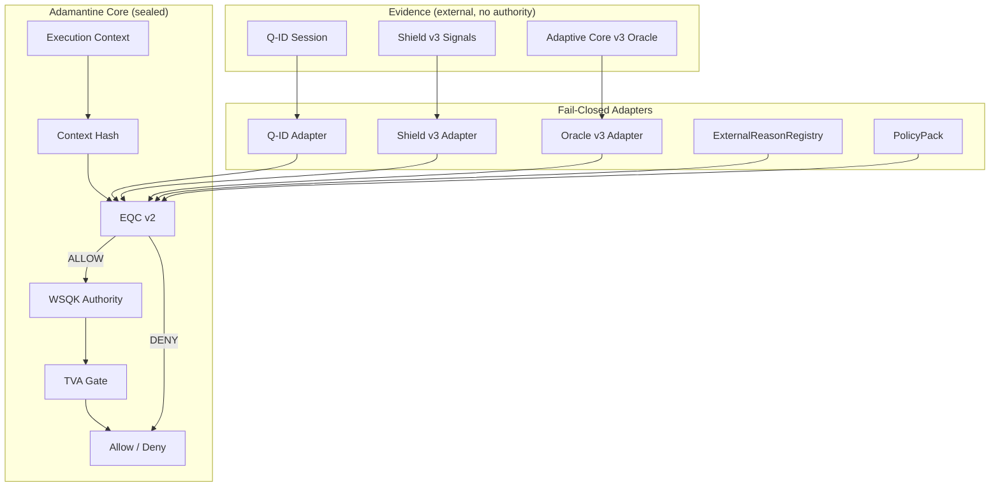

# 🔷 DigiByte Adamantine Wallet OS

\
\
\
\

------------------------------------------------------------------------

## Status: OS Proof Pack (v1.2.0)

This repository contains the sealed foundation of the **Adamantine
Wallet OS**.

This repository contains the sealed foundation of the **Adamantine
Wallet OS**.

Adamantine is a deterministic security decision engine for DigiByte
wallets.\
It defines **what is allowed to execute**, **under which conditions**,
and **why** --- without managing keys, signing transactions, or running
a wallet UI.

All critical boundaries are versioned, tested, and fail-closed.

------------------------------------------------------------------------

## What Is Included

### Decision & Authority Core

-   **EQC v1 + v2**
    -   v1: deterministic baseline decision logic\
    -   v2: multi-evidence reasoning (Q-ID + Shield + Adaptive Core)
-   **WSQK v1**
    -   Scoped, time-bound authority (no key custody)
-   **TVA Gate**
    -   Authority binding\
    -   Expiry enforcement\
    -   Replay protection
-   **Nonce Store**
    -   Injected, single-use replay prevention

------------------------------------------------------------------------

### Evidence & Adapters (Fail-Closed)

-   **Q-ID Adapter**
    -   Session validity\
    -   Time window enforcement
-   **Shield v3**
    -   Evidence-only defensive signals (Sentinel AI, ADN, DQSN, QWG,
        Guardian Wallet)\
    -   Strict adapter validation (no authority, no execution)
-   **Adaptive Core v3 Oracle**
    -   Deterministic risk evidence\
    -   Context-bound\
    -   Time-bound\
    -   Evidence-only
-   **ExternalReasonRegistry**
    -   Strict mapping of external signals → internal `ReasonId`\
    -   Deny-by-default governance (no free-form external reasons)
-   **PolicyPack**
    -   Explicit thresholds\
    -   Allowlists\
    -   Deny-by-default rules

------------------------------------------------------------------------

### Mobile Consumption (No Runtime)

-   Mobile execution boundary (v1)\
-   Mobile decision result contract\
-   ReasonId → UX-safe reason mapping\
-   Deterministic mobile result builder

Mobile apps consume **decisions only** --- they never execute core
logic.

------------------------------------------------------------------------

## Explicitly NOT Included (By Design)

Adamantine does **not**:

-   Manage or store private keys\
-   Sign or broadcast transactions\
-   Build wallet UI\
-   Persist user data\
-   Sync to cloud services\
-   Perform learning or AI inference\
-   Act as a DigiByte node or consensus component

Adamantine is **not a wallet**.\
It is the **security operating system** that wallets embed.

------------------------------------------------------------------------

## Architecture Diagram

------------------------------------------------------------------------

## Core Invariants

-   Deny-by-default\
-   Fail-closed on ambiguity\
-   Evidence ≠ authority ≠ execution\
-   Deterministic behaviour only\
-   Explicit versioned contracts\
-   No hidden power\
-   Explainability over automation\
-   External reasons must be registered and governed\
-   Shield signals can only strengthen deny, never force allow\
-   Oracle evidence can influence deny, never grant authority

These invariants are enforced in code and tests.

------------------------------------------------------------------------

## Coverage & Testing Philosophy

-   High coverage focused on security-critical paths\
-   Contract validation tested separately from adapters\
-   Negative-first testing\
-   Determinism and replay safety enforced\
-   Governance rules tested explicitly

Current coverage: **\>90%**, with all critical logic covered.

------------------------------------------------------------------------

## Roadmap Position

This repository represents a sealed foundation designed for additive
extension only.

Future work:

-   Mobile SDK integration\
-   Wallet runtime implementations (outside this repo)\
-   UI/UX layers\
-   Additional shield/oracle implementations

All future work must respect the frozen contracts and invariants defined
here.

------------------------------------------------------------------------

## License

MIT License --- **DarekDGB**
