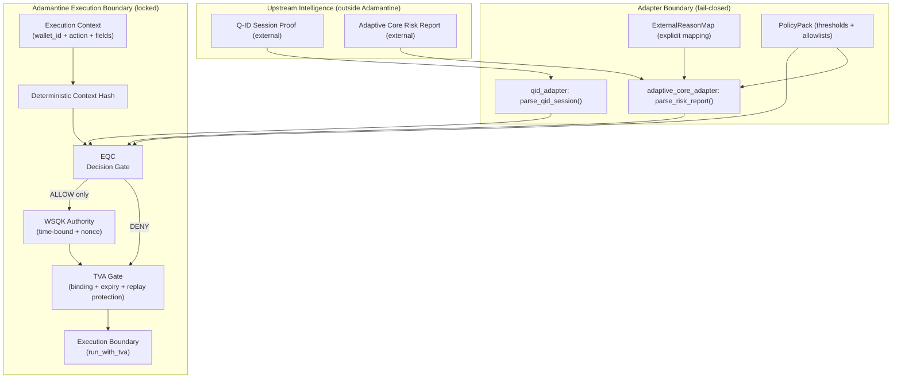

# 🔷 DigiByte Adamantine Wallet OS

<!--
BADGES: Replace <ORG> and <REPO> with your GitHub org/user + repository name.
Example: https://github.com/DarekDGB/DigiByte-Adamantine-Wallet-OS
-->


## Status: Foundation Locked (Not a wallet runtime yet)

This repository is a **clean, locked foundation** focused on **contracts, invariants, and deterministic fail-closed execution**.

Implemented:
- EQC v1 (decision foundation + deterministic context hashing)
- WSQK Authority v1 (time-bound authority + nonce)
- TVA Gate (binding, expiry, replay protection via injected nonce store)
- PolicyPack-driven risk thresholds & allowlists
- ExternalReasonMap-enforced adapters
- High-coverage CI with invariant-locked tests

Not implemented (by design):
- Wallet execution environment (keys, signing, broadcasting)
- Mobile runtime (iOS / Android)
- Shield v3 / Adaptive Core v3 live integration
- Durable nonce storage

**Quantum-Secure Execution Layer for DigiByte Wallets**  
*Architecture by DarekDGB — MIT Licensed*

---

## Purpose

**Adamantine Wallet OS** is not a traditional cryptocurrency wallet.

It is a **Wallet Operating System** whose sole responsibility is to ensure that  
**only context-approved, deterministic, and user-authorised actions are allowed  
to execute**, even under hostile conditions such as malware, compromised devices,
network anomalies, or social engineering.

Adamantine exists to make *unsafe wallet behaviour impossible by design*.

---

## What Adamantine IS

Adamantine Wallet OS is:

- a **secure execution layer** for DigiByte wallets
- a **consumer of shield intelligence**, not a generator of it
- a **runtime enforcement environment**, not a decision engine
- **mobile-first** (iOS and Android only)
- **consensus-neutral** (does not alter DigiByte protocol rules)
- **open-source and auditable** (MIT licensed)

It is the place where **decisions become irreversible actions — safely**.

---

## What Adamantine is NOT

Adamantine is **not**:

- a replacement for DigiByte Core
- a consensus or mining component
- a web wallet or browser runtime
- an AI or learning system
- a node authority
- a monolithic “do-everything” wallet

All intelligence, learning, and risk assessment happens *outside* Adamantine.

Adamantine only executes what is already approved.

---

## Architectural Position

Adamantine sits at the **final execution boundary** of the DigiByte security stack.

Execution pipeline:

```
EQC → WSQK → TVA → Execution
```

Upstream systems may:
- observe
- analyse
- classify
- recommend
- warn

But **only Adamantine executes**.

This separation is intentional and enforced.

---

## Architecture Diagram



---

## Core Principle

> **Decision, authority, and execution are never combined.**

Adamantine enforces execution **only after**:
- a valid decision exists
- authority is scoped and time-bound
- context integrity is verified

If any condition fails, execution does not occur.

There are no bypass paths.

---

## Security Philosophy

Adamantine is built on strict invariants:

- fail-closed by default
- no hidden authority
- no privileged maintainer paths
- deterministic behaviour only
- explicit user involvement where consequence exists
- explainability over automation

These rules are defined in `INVARIANTS.md` and apply to all future code.

---

## Project Status

This repository represents a **foundation-locked baseline**.

There is currently:
- no mobile runtime
- no signing or broadcasting logic
- no client UI

This is intentional.

Architecture, contracts, and invariants are defined **before** runtime integration begins.

---

## License

MIT License  
© 2025 **DarekDGB**

Use is permitted with attribution.
